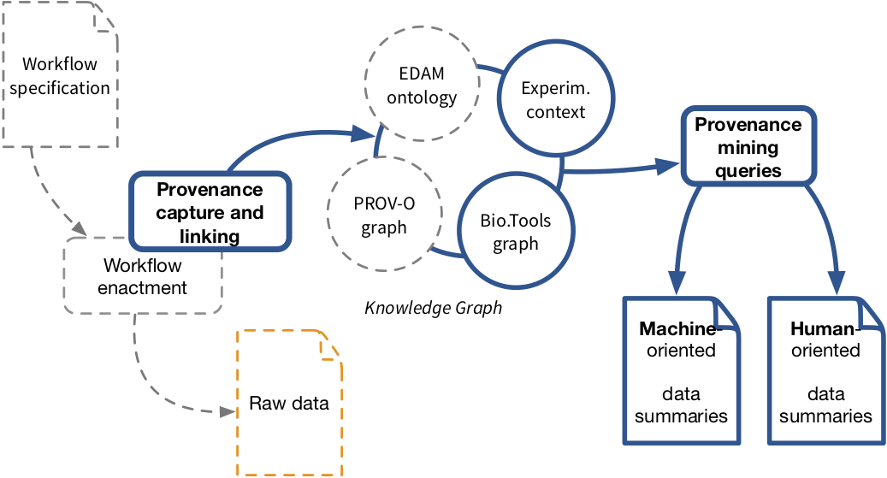
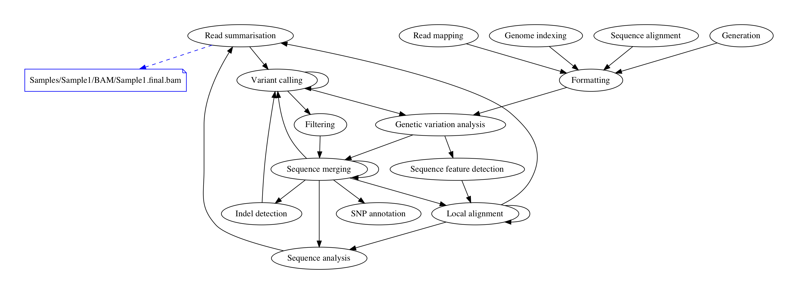

# fresh-toolbox [](https://mybinder.org/v2/gh/albangaignard/fresh-toolbox/master?filepath=FRESH-notebook.ipynb)

This notebook aims at demonstrating how to leverage workflow provenance (information on data processing chains) with a knowledge graph to produce human and machine -oriented data summaries.** We propose to leverage domain-specific annotation ([EDAM ontology](http://edamontology.org/)) from the bioinformatics tools registry [Bio.Tools](http://bio.tools) to automatically annotate workflow processed data in the form of data summaries.

All the process can be reproduced through the [](https://mybinder.org/v2/gh/albangaignard/fresh-toolbox/master?filepath=FRESH-notebook.ipynb) online platform.

### Contacts
  - Alban Gaignard: alban.gaignard@univ-nantes.fr
  - Hala Skaf-Molli: hala.skaf@univ-nantes.fr
  - Khalid Belhajjame: kbelhajj@googlemail.com

### Approach

Here are the main steps of this demonstration :
  1. Knowledge graph loading (With assume that a provenance is already available)
  1. Machine-oriented provenance mining queries
  1. Human-oriented provenance mining queries

### Results
Here is an example of the generated human-oriented data summaries.

```
...
The file Samples/Sample1/BAM/Sample1.realign.bai results from tool gatk2_indel_realigner-IP which Locally align two or more molecular sequences.
It was produced in the context of Rare Coding Variants in ANGPTL6 Are Associated with Familial Forms of Intracranial Aneurysm
...
```



### Software dependencies
  - [RdfLib](https://rdflib.readthedocs.io/en/stable/) for RDF data management and SPARQL querying
  - [NetworkX](https://networkx.github.io/documentation/stable/) for graph visualization
